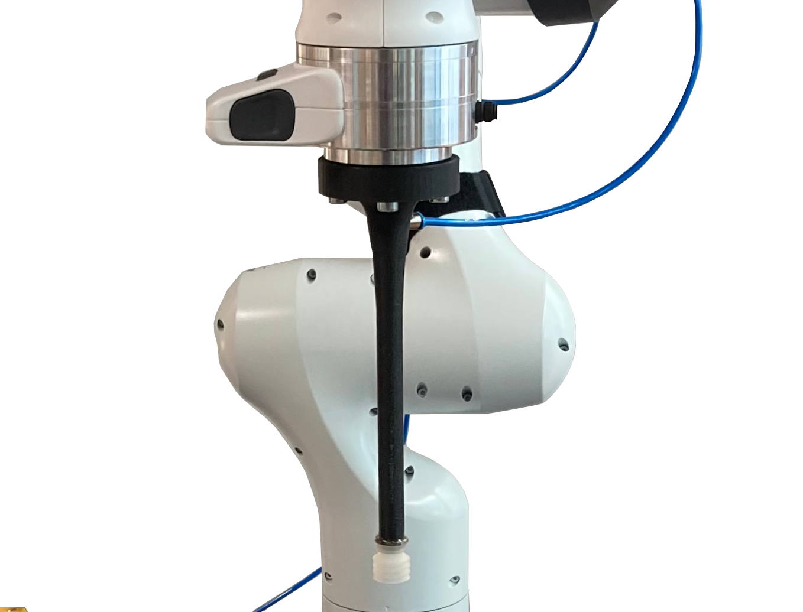
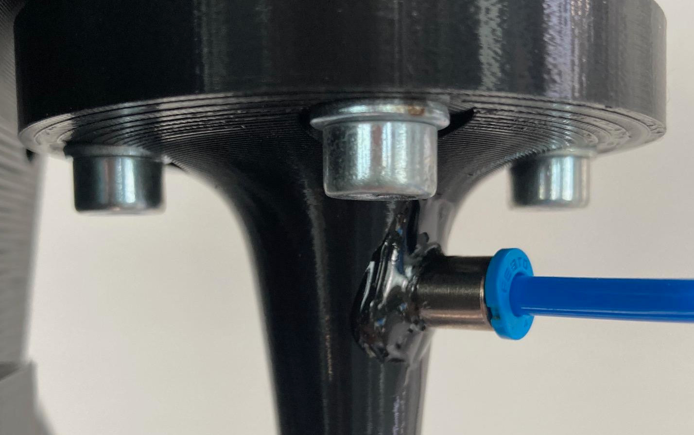

# MetaGraspNet Vacuum-End-Effector

## News [dd/mm/yyyy]
- [22/07/2024] **Initial Version**: First version released online. Additional details regarding control and ROS integration will be included in future updates.

## Overview
The MetaGraspNet vacuum end-effector is designed to provide efficient and reliable object handling capabilities for robotic arms. This project aims to provide a comprehensive guide on building and assembling a low-cost vacuum end-effector for use in research applications.

<p align="center">

</p>

### Features
- **High Efficiency**: Provides strong and consistent suction.
- **Versatile**: Capable of handling a wide range of objects.
- **Cost-Effective**: Print it in your labd and easy assembly.
- **Modular Design**: Easily mountable on various robotic arms or different suction cups.

## Table of Contents
1. [Overview](#overview)
2. [How to Build](#how-to-build)
4. [How to Use](#how-to-use)
6. [Citation](#Citation)
5. [License](#license)

## How to Build
This section provides step-by-step instructions on how to build the vacuum end-effector. It is designed for the Franka end-effector plate.

### Shopping List
- Vaccum generator (e.g. [Festo VN-07-M-I3-PQ2-VQ2-A](https://www.festo.com/gb/en/a/532634/?tab=TECHNICAL_DATA&jumpToAnchor=true))
- Suction cups (e.g. [Festo ESS-20-CN](https://www.festo.com/gr/en/a/189400/))
- Plastic tubing (e.g. [Festo PUN-H-4X0,75-BL](https://www.festo.com/de/en/a/197383/))
- Push-in fitting (e.g. [Festo QSM-M3-4-I](https://www.festo.com/de/en/a/153314/)) 
- epoxy two-component glue (e.g. [Pattex Kraft-Mix](https://www.amazon.de/-/en/Kraft-Mix-Extremely-Strength-Modelling-Transparent/dp/B004V4B6PE/ref=sr_1_8?crid=2JDAH80IJE4OS&dib=eyJ2IjoiMSJ9.qoWN3YqThmnkQgwYFZ5gHye6gYLTG1WlmdHD1YBQaUhLvQIqbSUQ7YGG9QsH07bisQvT_ERvGcOkV71jKfn1h6YuZcL1xcyHytIGAZ4142u3a2ESBhLzqY6ZQGow21y_0SkmKTtW4GKywxI4v5A5_eHevxwPubJVAaE8UnoVpVDR_VgnRNgK-zP0mR142so4S8qGFRKaDivvjzbUE9gIiKn8thHlt4fMcFQZClTXUQvZ9BGKPPr9a2SnNdUWPI18GEW8WoxPOTV0WN5BgTxavqKgtJy18-wMLvTcyfsPEQE.5DwZazILMh53XfgVfDc5U176yf84Y91spzEyAdukCUU&dib_tag=se&keywords=epoxy%2Btwo-component%2Bglue&qid=1721656657&sprefix=epoxy%2Btwo-component%2Bglue%2Caps%2C85&sr=8-8&th=1))

Products from other companies may also be suitable.

### Step-by-Step Instructions
1. **Print all parts**:
    - Print 3D part in ```./files/3d-parts```
    - Ensure part is clean and the air tube is free of filament.

2. **Clue the festo push-in fitting to the 3D-part**:
    - Connect the suction cup to the 3d part using a thread cutter, and optionally seal with two-component glue (not needed usually)
    - Attach the push-in fitting to the 3d part using a thread cutter and seal everything with epoxy two-component glue. Let it dry over night.

<p align="center">

</p>


3. **Final Assembly**:
    - Attach the vacuum pump and the push-in fitting.
    - Attach the air to the vacuum pump.

## How to Use
Code will be released soon.


## Citation
Please consider citing ([Link to Paper](https://ieeexplore.ieee.org/document/10309974)):
```
@ARTICLE{metagraspnetv2,
  author={Gilles, Maximilian and Chen, Yuhao and Zeng, Emily Zhixuan and Wu, Yifan and Furmans, Kai and Wong, Alexander and Rayyes, Rania},
  journal={IEEE Transactions on Automation Science and Engineering}, 
  title={MetaGraspNetV2: All-in-One Dataset Enabling Fast and Reliable Robotic Bin Picking via Object Relationship Reasoning and Dexterous Grasping}, 
  year={2023},
  volume={},
  number={},
  pages={1-19},
  doi={10.1109/TASE.2023.3328964}}
```

## License
The dataset is under **CC BY-NC-SA 3.0 license**. You may only use the database for academic purposes. For more details [see](https://creativecommons.org/licenses/by-nc-sa/3.0/).
